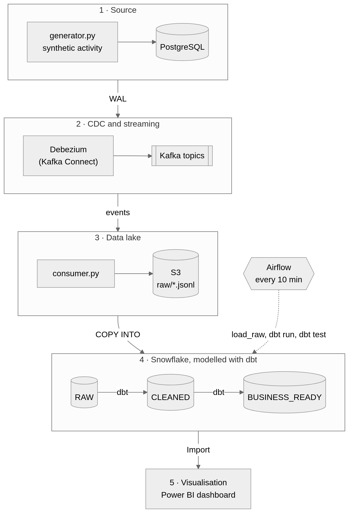
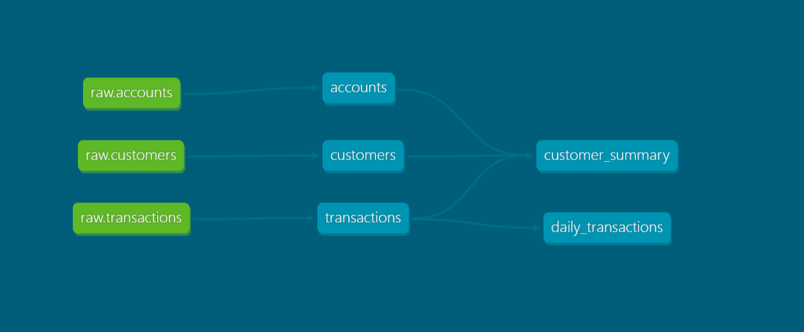
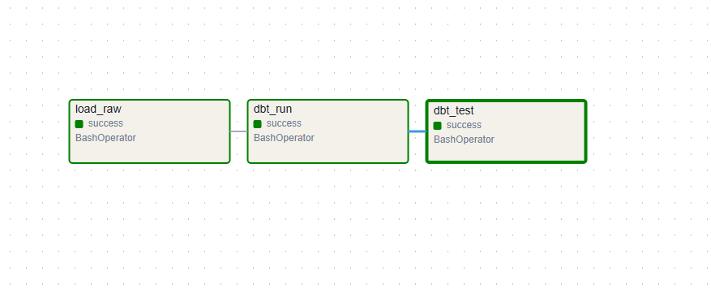
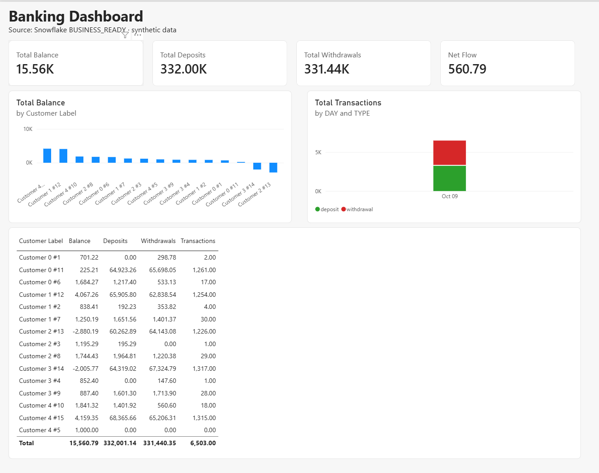

# Real-Time Banking Data Pipeline

[](https://github.com/Muhannad4555/Banking-Data-Engineering-Project/actions/workflows/ci.yml)

An end-to-end data engineering project. Every change in a PostgreSQL banking database is captured with **Change Data Capture (CDC)**, streamed through **Kafka**, stored in **S3**, loaded into **Snowflake**, modelled with **dbt** in medallion layers (raw, cleaned, business ready), orchestrated with **Airflow** and visualised in **Power BI**. The whole stack runs locally with **Docker Compose**, and **GitHub Actions** checks every push.

> All data is synthetic and produced by `generator.py`. No real banking data is used.

## Architecture



The diagram is a PNG so it also shows in the GitHub mobile app. Its Mermaid source is in [`docs/architecture.mmd`](docs/architecture.mmd).

| Stage | Tool | Role |
|---|---|---|
| Source | PostgreSQL 16 | `customers`, `accounts`, `transactions` tables with logical WAL enabled |
| CDC | Debezium on Kafka Connect | Reads the WAL and publishes one event per row change |
| Streaming | Apache Kafka (KRaft) | One topic per table, for example `banking.public.transactions` |
| Ingestion | `consumer.py` | Writes batched JSON-lines files to S3 |
| Storage | Amazon S3 | `raw/<table>/dt=YYYY-MM-DD/<timestamp>.jsonl` |
| Warehouse | Snowflake | `RAW`, `CLEANED` and `BUSINESS_READY` schemas (bronze, silver, gold) |
| Transformation | dbt | Parses events, keeps the latest version of each row, builds marts, tests data quality |
| Orchestration | Airflow | DAG `banking_pipeline`: `load_raw >> dbt_run >> dbt_test` |
| Visualisation | Power BI Desktop | Import-mode report on the `BUSINESS_READY` tables, read through the read-only `BI_READER` role |
| CI | GitHub Actions | Validates the Python files, the Compose file, the dbt project and the Airflow image |

## How the data flows

1. `generator.py` creates 5 customers with one account each, then inserts one random deposit or withdrawal per second and updates the balance in the same database transaction.
2. Debezium turns every change into an event with the operation (`op`: `c` create, `u` update, `d` delete, `r` snapshot read), the row before and after the change, and the WAL position (`source.lsn`).
3. `consumer.py` reads the topics and uploads batches (100 events or 30 seconds) to S3. Offsets are committed only after the upload succeeds, so no event is lost (at-least-once delivery).
4. Snowflake loads the files with `COPY INTO` into the `RAW` tables, where the full event is kept untouched in a `VARIANT` column.
5. dbt flattens the events, keeps the most recent event per primary key, drops deleted rows and builds the marts.

A change event looks like this (abbreviated):

```
{
  "before": null,
  "after": {"id": 8, "name": "Customer 2", "email": "...", "created_at": "..."},
  "source": {"table": "customers", "lsn": 26738568, ...},
  "op": "c",
  ...
}
```

## Data model (dbt)



| Layer | Models | Description |
|---|---|---|
| Cleaned | `customers`, `accounts`, `transactions` | Current state of each source table, rebuilt from the change log |
| Business ready | `customer_summary` | One row per customer: total balance, number of transactions, total deposits and withdrawals |
| Business ready | `daily_transactions` | Number and total amount of transactions per day and type |

The cleaned models are covered by 10 tests: `unique` and `not_null` on keys, `relationships` between tables and `accepted_values` for `transactions.type`.

## Orchestration (Airflow)



The DAG `banking_pipeline` loads the new S3 files into `RAW`, builds the dbt models and then runs the dbt tests, every 10 minutes. If a task fails, the tasks after it do not run.

## Dashboard (Power BI)



The report reads the two `BUSINESS_READY` tables in Import mode through the read-only `BI_READER` role (`snowflake/04_bi_role.sql`). It shows total balance, deposits, withdrawals and net flow, the balance per customer, the transactions per day split by deposit and withdrawal, and a per-customer table. The measures are in [`powerbi/measures.dax`](powerbi/measures.dax).

Customer names repeat across runs of `generator.py` (`Customer 0` to `Customer 4`), so the report labels each customer with name and id (the `Customer Label` column).

## Repository layout

```
.
├── .github/workflows/ci.yml        GitHub Actions checks
├── airflow/
│   ├── Dockerfile                  Airflow image with dbt in its own virtualenv
│   ├── dags/banking_pipeline.py    load_raw >> dbt_run >> dbt_test
│   └── scripts/load_raw.py         COPY INTO the RAW tables
├── banking_dbt/                    dbt project (cleaned and business_ready models)
├── docs/                           Images used in this README
├── powerbi/                        DAX measures used by the Power BI report
├── snowflake/                      Setup SQL: storage integration, stage, tables, roles
├── sql/init.sql                    PostgreSQL schema
├── connector.json                  Debezium connector configuration
├── consumer.py                     Kafka to S3
├── generator.py                    Synthetic banking activity
├── docker-compose.yml              Postgres, Kafka, Kafka Connect, Airflow
├── requirements.txt
└── .env.example                    Variables to copy into .env
```

## Getting started

Developed and tested on Windows 11 with Docker Desktop. Other platforms are untested.

**Prerequisites:** Docker Desktop, Python 3.12, an AWS account (S3 and IAM), a Snowflake account (a trial is enough) and, for the dashboard, Power BI Desktop (Windows only).

### 1. Install

```bash
git clone https://github.com/Muhannad4555/Banking-Data-Engineering-Project.git
cd Banking-Data-Engineering-Project
python -m venv .venv
```

Activate the environment (`.venv\Scripts\Activate.ps1` on Windows PowerShell, `source .venv/bin/activate` on macOS and Linux), then:

```bash
pip install -r requirements.txt
```

### 2. Configure secrets

Copy `.env.example` to `.env` and fill in the S3 bucket, the AWS region, the AWS access key of the ingestion user and your Snowflake account, user and password. `.env` is git-ignored and must never be committed.

### 3. Start the stack

```bash
docker compose up -d
```

Wait about a minute for Kafka Connect, then register the Debezium connector (use `curl.exe` in PowerShell):

```bash
curl -X POST -H "Content-Type: application/json" --data @connector.json http://localhost:8083/connectors
```

Host ports: PostgreSQL `5433` (not 5432, to avoid clashing with a local PostgreSQL), Kafka `29092`, Kafka Connect `8083`, Airflow `8081`.

### 4. Generate data and ship it to S3

Run these in two terminals:

```bash
python generator.py
```

```bash
python consumer.py
```

After about 30 seconds files appear under `raw/` in your bucket.

### 5. Set up Snowflake

Run the SQL files in a Snowsight worksheet:

1. `snowflake/01_setup.sql`, section by section. Replace `<BUCKET>` and `<ROLE_ARN>` first, and update the AWS role trust policy with the values returned by `DESC INTEGRATION s3_int` before running section 2.
2. `snowflake/02_dbt_role.sql` creates the `TRANSFORMER` role for dbt.
3. `snowflake/03_loader_role.sql` creates the `LOADER` role for Airflow.
4. `snowflake/04_bi_role.sql` creates the read-only `BI_READER` role for Power BI.

In files 2, 3 and 4 replace `<YOUR_USER>` with your Snowflake user and keep the double quotes (required when the name starts with a digit).

<details>
<summary>AWS setup (IAM)</summary>

**Ingestion user (used by `consumer.py`).** Create an S3 bucket with all public access blocked, an IAM user and an access key, with this write-only policy:

```json
{
  "Version": "2012-10-17",
  "Statement": [{
    "Effect": "Allow",
    "Action": "s3:PutObject",
    "Resource": "arn:aws:s3:::YOUR_BUCKET/raw/*"
  }]
}
```

**Role for Snowflake.** Create a read-only policy and attach it to a new role:

```json
{
  "Version": "2012-10-17",
  "Statement": [
    {
      "Effect": "Allow",
      "Action": ["s3:GetObject", "s3:GetObjectVersion"],
      "Resource": "arn:aws:s3:::YOUR_BUCKET/raw/*"
    },
    {
      "Effect": "Allow",
      "Action": "s3:ListBucket",
      "Resource": "arn:aws:s3:::YOUR_BUCKET",
      "Condition": { "StringLike": { "s3:prefix": ["raw/*"] } }
    }
  ]
}
```

After creating the storage integration, set the role trust policy to the values shown by `DESC INTEGRATION s3_int`:

```json
{
  "Version": "2012-10-17",
  "Statement": [{
    "Effect": "Allow",
    "Principal": { "AWS": "<STORAGE_AWS_IAM_USER_ARN>" },
    "Action": "sts:AssumeRole",
    "Condition": { "StringEquals": { "sts:ExternalId": "<STORAGE_AWS_EXTERNAL_ID>" } }
  }]
}
```

</details>

### 6. Transform with dbt

```bash
cd banking_dbt
dbt run
dbt test
```

dbt reads `SNOWFLAKE_ACCOUNT`, `SNOWFLAKE_USER` and `SNOWFLAKE_PASSWORD` from the environment. With dbt-core 1.12.5 they are also picked up from the `.env` file in the repository root; otherwise export them in your shell.

To browse the documentation and the lineage graph:

```bash
dbt docs generate
dbt docs serve --port 8090
```

### 7. Orchestrate with Airflow

Open http://localhost:8081 and sign in as `admin`. The password is generated at startup:

```bash
docker compose exec airflow cat /opt/airflow/standalone_admin_password.txt
```

The DAG `banking_pipeline` starts paused. Unpause it or trigger it manually. It runs every 10 minutes, so it wakes the Snowflake warehouse each time; pause it when you are not using it.

### 8. Build the dashboard

In Power BI Desktop choose `Get data`, then `Snowflake`, with the server `<account_identifier>.snowflakecomputing.com`, the warehouse `COMPUTE_WH`, `Import` mode and, under `Advanced options`, the role `BI_READER`. Sign in on the `Database` tab with your Snowflake user and password, load `CUSTOMER_SUMMARY` and `DAILY_TRANSACTIONS` from `BANKING` / `BUSINESS_READY`, then create the measures from `powerbi/measures.dax`. After Airflow has rebuilt the tables, click `Refresh` in Power BI.

## Design decisions

- **A small Python consumer instead of the S3 sink connector.** About 45 lines, easy to read and debug. Offsets are committed after the upload, and the resulting duplicates are removed in dbt.
- **Raw events are stored untouched.** `RAW` is an append-only log in a `VARIANT` column, so parsing logic can be fixed in dbt and replayed without re-ingesting.
- **Latest event per key.** `qualify row_number() over (partition by id order by lsn desc) = 1`, then rows with `op = 'd'` are dropped after picking the latest event. Filtering deletes first would bring back the previous version of a deleted row.
- **No AWS keys in Snowflake.** A storage integration lets Snowflake assume an IAM role, protected by an external ID.
- **Least privilege.** The ingestion user can only write to `raw/`. The Snowflake roles `LOADER` (load into `RAW`), `TRANSFORMER` (read `RAW`, write `CLEANED` and `BUSINESS_READY`) and `BI_READER` (read `BUSINESS_READY`) are separate.
- **dbt in its own virtualenv inside the Airflow image,** because its dependencies conflict with the versions Airflow pins.
- **Amounts as strings in the events** (`decimal.handling.mode=string`), cast to `NUMBER(12,2)` in dbt.
- **No fan-out in `customer_summary`.** Balances and transactions are aggregated in separate CTEs before joining, so balances are not counted once per transaction.
- **The dashboard reads only the gold layer.** Power BI never touches `RAW` or `CLEANED`, and the dashboard totals were reconciled against Snowflake queries.

## Limitations and next steps

- Synthetic, low-volume data.
- No persistent Docker volumes: `docker compose down` wipes PostgreSQL and Kafka, and the connector must be registered again.
- dbt models are rebuilt as full tables on every run (no incremental models yet).
- Airflow runs in `standalone` mode with SQLite, which suits learning but not production.
- Kafka is a single node with replication factor 1.
- CI validates the project structure (`dbt parse`) but does not run the models against Snowflake.
- The Power BI report is built by hand in Power BI Desktop (Import mode, manual refresh). Scheduled refresh would need the Power BI service.
- Planned: event-driven loading with Snowpipe.

## Security notes

`.env` is never committed. The `postgres` / `postgres` credentials in `docker-compose.yml`, `connector.json` and `generator.py` are throw-away defaults for the local containers only.
